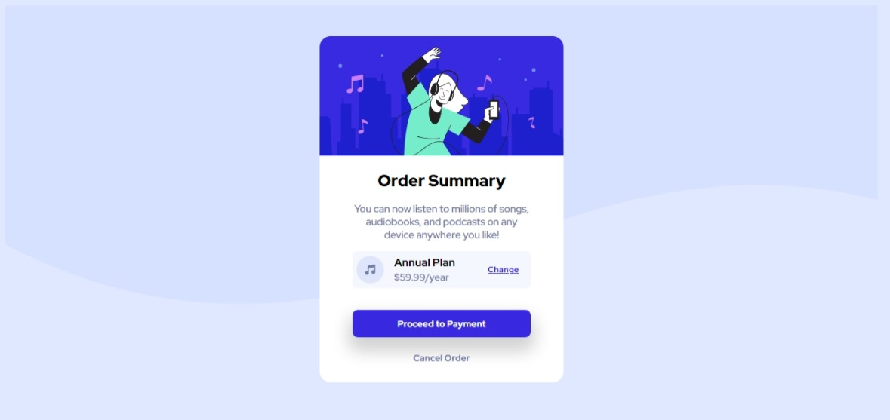

# Frontend Mentor - Order summary card solution

This is a solution to the [Order summary card challenge on Frontend Mentor](https://www.frontendmentor.io/challenges/order-summary-component-QlPmajDUj). Frontend Mentor challenges help you improve your coding skills by building realistic projects. 

## Table of contents

- [Overview](#overview)
  - [The challenge](#the-challenge)
  - [Screenshot](#screenshot)
  - [Links](#links)
- [My process](#my-process)
  - [Built with](#built-with)
  - [What I learned](#what-i-learned)
- [Author](#author)


## Overview

### The challenge

Users should be able to:

- See hover states for interactive elements

### Screenshot




### Links

- Solution URL: ((https://www.frontendmentor.io/solutions/responsive-order-summary-page-using-flexboxes-DwjsI-TPpE))
- Live Site URL: ((https://afnan9565.github.io/order-summary-component-main/))

## My process

### Built with

- Semantic HTML5 markup
- CSS custom properties
- Flexbox
- CSS Grid


### What I learned

I learned how to make wave background using a svg file for this is created a `main` class `.hero` which contains the whole thing and then applied a colour to the body and set the `background-image` of the `.hero` with `no-repeat`  

```html
<main class="hero">
  <div class="box">
  </div>
</main>
```
```css
.hero{
    background-image: url(images/pattern-background-desktop.svg);
    background-repeat: no-repeat;
    background-size:auto;
    /* background-position: 80px; */
    height: 97vh;
    display: flex;
    align-items: center;
    justify-content: center;
    width: 98vw;
}
```

## Author

- Website - [Afnan Ahmad](https://afnan9565.github.io/portfolio)
- Frontend Mentor - [Afnan9565](https://www.frontendmentor.io/profile/Afnan9565)

